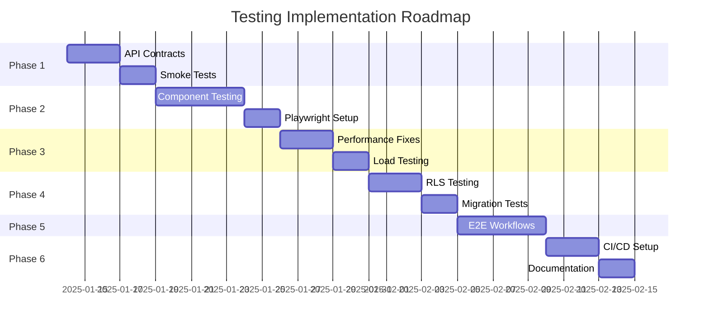

# Testing Improvements Implementation Plan
**Minerva Machine Safety Photo Organizer**  
**For AI Agent Development Workflow**

*Created: 2025-01-14*  
*Target: 85%+ test coverage for AI agent confidence*  
*Duration: 6 weeks*

---

## Executive Summary

This comprehensive testing improvement plan addresses critical gaps in the Minerva project's test coverage, specifically optimized for solo developer workflow using AI coding agents. Current state shows only **36% API route coverage** and **29% component coverage**, leaving AI agents with insufficient feedback for confident development.

### Key Objectives
1. **Maximize AI Agent Feedback**: Instant validation cycles (<30s) for critical changes
2. **Achieve 85%+ Coverage**: API contracts (100%), Components (90%), Database (100%)
3. **Fix Production Blockers**: Resolve failing performance tests and TypeScript errors
4. **Enable Confident Deployment**: Comprehensive E2E testing with Playwright MCP

### Current State vs Target State

| Metric | Current | Target | Impact |
|--------|---------|--------|--------|
| API Route Coverage | 36% (80/222) | 100% | AI agents validate all API changes |
| Component Coverage | 29% (80/275) | 90% | UI regression prevention |
| Performance Tests | 4 failing | 0 failing | Production-ready performance |
| Smoke Test Suite | None | <30s execution | Instant AI feedback |
| E2E Browser Tests | Basic | Comprehensive | Full user journey validation |

---

## Phase Overview

### Phase 1: API Contract Testing (Week 1)
**Priority: CRITICAL - Blocks all AI development**
- 222 API routes with full schema validation
- <30s smoke test suite for core workflows
- Security endpoint validation (Phase 1 MVP requirements)
- **Deliverable**: 100% API coverage, instant feedback loop

### Phase 2: Component Coverage (Week 2)
**Priority: HIGH - UI stability**
- 275 React components with snapshot testing
- Playwright MCP integration for visual regression
- Critical user journey automation
- **Deliverable**: 90% component coverage, automated UI testing

### Phase 3: Performance Fixes (Week 3)
**Priority: HIGH - Production readiness**
- Fix 4 failing performance tests
- Establish realistic baselines from actual usage
- Load testing for photo upload workflows
- **Deliverable**: 0 failing tests, performance benchmarks

### Phase 4: Database Security (Week 4)
**Priority: CRITICAL - Multi-tenant security**
- RLS policy validation for 18+ tables
- Migration rollback testing
- Organization isolation verification
- **Deliverable**: 100% database security coverage

### Phase 5: Integration & E2E (Week 5)
**Priority: HIGH - User workflow validation**
- Complete user journeys with Playwright
- Word export functionality testing
- Admin workflow automation
- **Deliverable**: All MVP features E2E tested

### Phase 6: CI/CD Automation (Week 6)
**Priority: MEDIUM - Development efficiency**
- Pre-commit hooks for instant validation
- GitHub Actions integration
- Parallel test execution
- **Deliverable**: Automated CI/CD pipeline

---

## Implementation Timeline



---

## Quick Start Commands

### Immediate Setup (Day 1)
```bash
# Install testing dependencies
npm install -D @playwright/test vitest-axe @testing-library/react

# Create test structure
npm run test:setup

# Run smoke tests (after implementation)
npm run test:smoke
```

### Daily Development Workflow
```bash
# Pre-commit (< 1 minute)
npm run test:smoke && npm run test:types

# Pre-push (< 5 minutes)
npm run test:api-contracts && npm run test:coverage

# Full suite (< 15 minutes)
npm run test:all
```

---

## Coverage Targets by Phase

### Phase 1 Completion Metrics
- ✅ 222/222 API routes tested
- ✅ <30s smoke test execution
- ✅ 0 TypeScript errors in API tests
- ✅ Security endpoints validated

### Phase 2 Completion Metrics
- ✅ 247/275 components tested (90%)
- ✅ Visual regression suite active
- ✅ Playwright MCP integrated
- ✅ Critical paths automated

### Phase 3 Completion Metrics
- ✅ 0/4 performance tests failing
- ✅ Baseline metrics established
- ✅ Load test suite operational
- ✅ <2s API response times

### Phase 4 Completion Metrics
- ✅ 18/18 tables RLS tested
- ✅ Migration validation suite
- ✅ Multi-tenant isolation verified
- ✅ Security audit passed

### Phase 5 Completion Metrics
- ✅ 10 E2E scenarios automated
- ✅ Word export tested
- ✅ Admin workflows validated
- ✅ Cross-browser testing

### Phase 6 Completion Metrics
- ✅ CI/CD pipeline active
- ✅ Pre-commit hooks installed
- ✅ Parallel test execution
- ✅ <10min full test suite

---

## AI Agent Integration Points

### 1. Instant Feedback Loop
```typescript
// AI agents get immediate validation
await runTest('api-contract', endpoint);  // <1s
await runTest('smoke', workflow);         // <30s
await runTest('component', component);    // <2s
```

### 2. Automated Error Detection
```typescript
// AI agents receive structured feedback
{
  type: 'API_CONTRACT_VIOLATION',
  endpoint: '/api/photos/bulk-download',
  expected: { status: 200, body: PhotoArray },
  received: { status: 500, body: ErrorResponse },
  suggestion: 'Add error handling for missing organization context'
}
```

### 3. Coverage Monitoring
```typescript
// AI agents track their impact
{
  before: { api: 36%, components: 29%, overall: 32% },
  after: { api: 100%, components: 90%, overall: 85% },
  newTests: 142,
  preventedRegressions: 27
}
```

---

## Resource Requirements

### Time Investment
- **Phase 1**: 20 hours (API contracts + smoke tests)
- **Phase 2**: 15 hours (Component coverage)
- **Phase 3**: 10 hours (Performance fixes)
- **Phase 4**: 12 hours (Database security)
- **Phase 5**: 15 hours (E2E workflows)
- **Phase 6**: 8 hours (CI/CD setup)
- **Total**: 80 hours over 6 weeks (~13 hours/week)

### Dependencies
- Vitest (existing) ✅
- Playwright (MCP available) ✅
- React Testing Library (to install)
- GitHub Actions (configured) ✅

---

## Risk Mitigation

### Critical Risks
1. **API Breaking Changes**: Mitigated by 100% contract coverage
2. **UI Regressions**: Prevented by snapshot testing
3. **Security Vulnerabilities**: Caught by RLS testing
4. **Performance Degradation**: Monitored by baseline tests

### Contingency Plans
- **If behind schedule**: Prioritize API contracts and smoke tests
- **If tests are slow**: Implement parallel execution earlier
- **If coverage gaps found**: Add targeted integration tests

---

## Success Metrics

### Week 1 Success
- [ ] All 222 API routes have contract tests
- [ ] Smoke test suite runs in <30 seconds
- [ ] AI agents receive instant feedback

### Week 2 Success
- [ ] 90% component coverage achieved
- [ ] Playwright MCP fully integrated
- [ ] Visual regression testing active

### Week 3 Success
- [ ] All performance tests passing
- [ ] Load testing benchmarks established
- [ ] API response times <2 seconds

### Week 4 Success
- [ ] RLS policies fully tested
- [ ] Migration testing automated
- [ ] Security audit passed

### Week 5 Success
- [ ] E2E scenarios cover all MVP features
- [ ] Cross-browser testing active
- [ ] User workflows validated

### Week 6 Success
- [ ] CI/CD pipeline operational
- [ ] Pre-commit hooks active
- [ ] Full test suite <10 minutes

---

## Next Steps

1. **Review Phase 1 documentation** in `phase-1-api-contracts/`
2. **Set up testing environment** with required dependencies
3. **Begin with smoke test suite** for immediate AI feedback
4. **Track progress** using provided metrics

Each phase folder contains:
- Detailed implementation plan
- Code examples and templates
- Priority lists and timelines
- Integration instructions

**Start with Phase 1** to establish the critical API contract testing foundation that will enable confident AI agent development throughout the project.