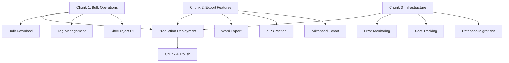

# Minerva Implementation Master Plan

**Document Version:** 1.0  
**Created:** July 13, 2025  
**Target Completion:** August 5, 2025 (3 weeks)  
**Project Status:** 85-90% Complete → Production Ready

---

## 📋 Executive Summary

This document provides a comprehensive implementation plan to complete the remaining 10-15% of the Minerva Machine Safety Photo Organizer and achieve production readiness. The work is organized into 4 focused chunks, each with detailed specifications, timelines, and deliverables.

**Total Estimated Effort:** 16-23 development days  
**Parallel Development Possible:** Yes, Chunks 1-3 can run in parallel  
**Critical Path:** Chunk 1 (Bulk Operations) → Production Deployment

---

## 🎯 Implementation Overview

### Completion Strategy

The remaining work is divided into **4 focused chunks** that address specific functional areas:

1. **🔧 Chunk 1: Bulk Operations & Core UX** (Critical - 5-7 days)
2. **📊 Chunk 2: Export & Integration Features** (Critical - 4-6 days)  
3. **⚙️ Chunk 3: Production Infrastructure** (High Priority - 3-4 days)
4. **🎨 Chunk 4: Polish & Enhancement** (Medium Priority - 4-6 days)

### Development Approach

- **Parallel Development**: Chunks 1, 2, and 3 can be developed simultaneously
- **Incremental Testing**: Each chunk includes comprehensive testing requirements
- **Progressive Deployment**: Features can be deployed as chunks are completed
- **Quality Gates**: Each chunk has specific acceptance criteria

---

## 📦 Chunk Breakdown & Dependencies

---

## 🚀 Implementation Schedule

### Week 1: Core Functionality (Chunks 1 & 2)
- **Days 1-3**: Bulk Operations implementation
- **Days 4-5**: Export functionality development
- **Parallel**: Infrastructure setup (Chunk 3)

### Week 2: Integration & Testing
- **Days 6-8**: Feature integration and testing
- **Days 9-10**: Production infrastructure completion
- **End-to-end testing**: Full workflow validation

### Week 3: Polish & Deployment
- **Days 11-13**: Polish and enhancement features
- **Days 14-15**: Production deployment and validation
- **Day 16**: Final testing and go-live

---

## 📋 Master Task List

### 🔥 CRITICAL PATH ITEMS (Must Complete for Production)

| Task | Chunk | Priority | Effort | Dependencies |
|------|-------|----------|--------|--------------|
| Bulk Download with ZIP | 1 | P0 | 2-3 days | None |
| Tag Management Modal | 1 | P0 | 2-3 days | None |
| Site/Project Upload UI | 1 | P0 | 1-2 days | None |
| Word Document Export | 2 | P0 | 3-4 days | None |
| Error Monitoring Setup | 3 | P1 | 1 day | None |
| Cost Monitoring | 3 | P1 | 1 day | None |

### ⚠️ HIGH PRIORITY ITEMS (Production Readiness)

| Task | Chunk | Priority | Effort | Dependencies |
|------|-------|----------|--------|--------------|
| Database Migrations | 3 | P1 | 1 day | None |
| Admin Feedback Interface | 4 | P2 | 2-3 days | Chunk 3 |
| Search Operators (AND/OR) | 4 | P2 | 1-2 days | None |
| User Feedback Status | 4 | P2 | 1-2 days | Chunk 3 |

### ✨ ENHANCEMENT ITEMS (Post-Production)

| Task | Chunk | Priority | Effort | Dependencies |
|------|-------|----------|--------|--------------|
| AI Error Notifications | 4 | P3 | 1 day | Chunk 3 |
| Advanced Export Templates | 2 | P3 | 2-3 days | Chunk 2 |
| Performance Optimization | 4 | P3 | 2-3 days | All chunks |

---

## 🎯 Success Criteria

### Technical Acceptance Criteria
- [ ] All critical features functional and tested
- [ ] Zero blocking bugs in production environment
- [ ] Performance targets met (sub-second search, <2min uploads)
- [ ] Security review passed
- [ ] Error monitoring operational

### Business Acceptance Criteria
- [ ] Engineer workflow fully supported (photo to report)
- [ ] SharePoint integration workflow functional
- [ ] Bulk operations efficient for 20+ photos
- [ ] Export formats meet reporting requirements
- [ ] Cost monitoring prevents budget overruns

### User Experience Criteria
- [ ] Mobile experience polished and responsive
- [ ] Loading states and error handling comprehensive
- [ ] Keyboard shortcuts and accessibility complete
- [ ] Help documentation and onboarding ready

---

## 📚 Documentation Structure

Each chunk will have dedicated documentation:

1. **`CHUNK_01_BULK_OPERATIONS.md`** - Bulk download, tagging, site/project UI
2. **`CHUNK_02_EXPORT_FEATURES.md`** - Word export, ZIP creation, advanced export
3. **`CHUNK_03_INFRASTRUCTURE.md`** - Monitoring, cost tracking, database
4. **`CHUNK_04_POLISH_ENHANCEMENT.md`** - Admin interfaces, search improvements

Additional documentation:
- **`TESTING_STRATEGY.md`** - Comprehensive testing approach
- **`DEPLOYMENT_GUIDE.md`** - Production deployment procedures
- **`SECURITY_REVIEW.md`** - Security assessment and recommendations

---

## ⚡ Quick Start Guide

### For Development Team

1. **Review Master Plan** (this document)
2. **Choose Chunk Assignment** based on expertise and dependencies
3. **Read Chunk-Specific Documentation** for detailed requirements
4. **Set Up Development Environment** per chunk requirements
5. **Begin Implementation** following chunk specifications

### For Project Management

1. **Assign Chunks to Developers** based on skills and availability
2. **Set Up Progress Tracking** using provided task lists
3. **Schedule Reviews** at chunk completion milestones
4. **Coordinate Integration Testing** between chunks
5. **Plan Production Deployment** following the deployment guide

---

## 🔗 Related Documents

- **[Project Review Report](./PROJECT_REVIEW_REPORT.md)** - Detailed current state analysis
- **[Original PRD](../documentation/prd.md)** - Product requirements and specifications
- **[Multi-Agent Strategy](../multi_agent_dev_strategy.md)** - Original development approach

---

## 📞 Support & Escalation

### Technical Issues
- Review chunk-specific documentation first
- Check existing codebase for patterns and examples
- Escalate to tech lead for architectural decisions

### Scope Changes
- Document in chunk-specific files
- Update effort estimates and timelines
- Communicate to project stakeholders

### Blockers
- Identify dependencies and alternatives
- Document blocker in chunk status
- Escalate to unblock path forward

---

This master plan serves as the foundation for completing Minerva's development. Each chunk builds upon this framework with detailed implementation specifications, code examples, and testing requirements.

**Next Step:** Review individual chunk documentation and begin implementation based on priority and team capacity.