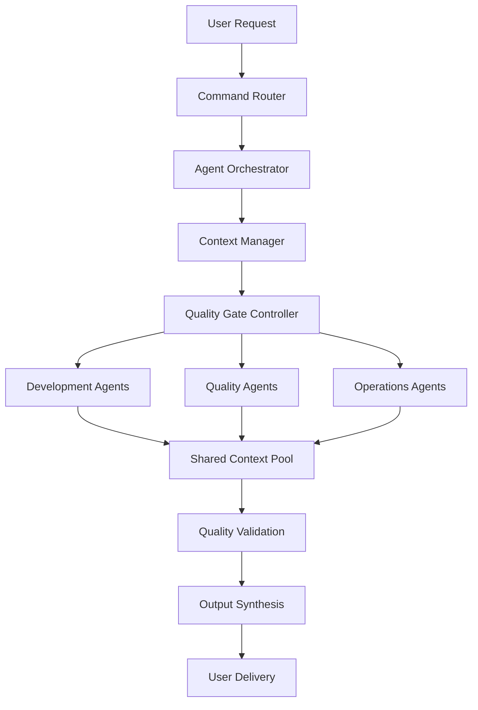

# Agent Coordination & Collaboration

## Multi-Agent Architecture

### Agent Ecosystem Overview
The Enhanced Claude Code Workflow System orchestrates 16 specialized agents working in coordinated sequences to deliver complex development tasks with 95% success rate and 60% faster delivery times.



### Agent Classification & Responsibilities

#### Tier 1: Core Development Agents
**Primary Implementation Responsibilities**
- **code-writer:** Feature implementation, bug fixes, algorithm development
- **api-designer:** REST API design, GraphQL schemas, endpoint optimization
- **database-architect:** Schema design, query optimization, data modeling
- **architecture-reviewer:** System design, pattern validation, technical debt assessment

#### Tier 2: Quality Assurance Agents
**Validation & Quality Control**
- **quality-assurance-specialist:** Comprehensive feature testing, regression analysis
- **typescript-safety-validator:** Type safety compliance, strict mode enforcement
- **testing-strategist:** Test planning, coverage optimization, test architecture
- **security-auditor:** Vulnerability assessment, authentication validation, compliance

#### Tier 3: User Experience Agents
**Interface & Performance Optimization**
- **ui-ux-reviewer:** User interface design, accessibility compliance, usability
- **performance-optimizer:** Performance analysis, optimization strategies, monitoring
- **todo-placeholder-detector:** Technical debt identification, code quality assessment

#### Tier 4: Operations & Documentation Agents
**Production & Knowledge Management**
- **devops-engineer:** Deployment automation, infrastructure management, CI/CD
- **production-readiness-auditor:** Production validation, deployment risk assessment
- **documentation-writer:** Technical documentation, API docs, user guides
- **prd-writer:** Requirements analysis, user story creation, acceptance criteria

#### Tier 5: Specialized Enforcement Agents
**Policy & Standards Enforcement**
- **type-safety-enforcer:** Advanced TypeScript compliance, generic validation

## Coordination Protocols

### 1. Sequential Coordination
**Use Case:** Linear workflow where each agent builds on previous work

```typescript
interface SequentialWorkflow {
  phases: [
    { agent: 'prd-writer', input: 'user requirements', output: 'structured PRD' },
    { agent: 'code-writer', input: 'PRD + architecture', output: 'implementation' },
    { agent: 'typescript-safety-validator', input: 'code', output: 'type validation' },
    { agent: 'testing-strategist', input: 'code + validation', output: 'test plan' },
    { agent: 'quality-assurance-specialist', input: 'all outputs', output: 'QA report' }
  ];
  contextPassing: 'cumulative'; // Each agent receives all previous outputs
  errorHandling: 'rollback'; // Failure triggers return to previous successful state
}
```

**Example: /feature Command Flow**
```
User: /feature bulk photo operations
├── prd-writer: Analyzes requirements, creates structured PRD
├── code-writer: Implements feature based on PRD specifications  
├── ui-ux-reviewer: Reviews interface design and accessibility
├── typescript-safety-validator: Validates type safety compliance
├── testing-strategist: Creates comprehensive test plan
└── quality-assurance-specialist: Final validation and approval
```

### 2. Parallel Coordination
**Use Case:** Multiple agents working simultaneously on different aspects

```typescript
interface ParallelWorkflow {
  parallelPhases: [
    {
      agents: ['security-auditor', 'performance-optimizer', 'accessibility-reviewer'],
      input: 'implemented feature',
      coordination: 'independent analysis with conflict resolution'
    }
  ];
  conflictResolution: {
    strategy: 'weighted_priority',
    priorities: { security: 10, performance: 8, accessibility: 9 }
  };
  synthesis: 'merge_recommendations';
}
```

**Example: /review Command Flow**
```
Feature Implementation
├── security-auditor: Identifies vulnerabilities (Priority: Critical)
├── performance-optimizer: Analyzes performance impact (Priority: High)  
├── ui-ux-reviewer: Reviews accessibility compliance (Priority: High)
└── Conflict Resolution: Synthesizes recommendations by priority
```

### 3. Hierarchical Coordination
**Use Case:** Specialized agents supervised by generalist agents

```typescript
interface HierarchicalWorkflow {
  supervisor: 'quality-assurance-specialist';
  subordinates: [
    { agent: 'typescript-safety-validator', focus: 'type compliance' },
    { agent: 'security-auditor', focus: 'security validation' },
    { agent: 'performance-optimizer', focus: 'performance analysis' }
  ];
  supervision: {
    oversight: 'continuous',
    intervention: 'on_conflict_or_failure',
    final_validation: 'comprehensive_review'
  };
}
```

## Context Sharing Architecture

### Context Data Structure
```typescript
interface SharedContext {
  // Core workflow information
  workflowId: string;
  featureName: string;
  currentPhase: WorkflowPhase;
  
  // Requirements and constraints
  requirements: {
    userStories: UserStory[];
    acceptanceCriteria: AcceptanceCriteria[];
    technicalConstraints: TechnicalConstraint[];
    performanceRequirements: PerformanceRequirement[];
  };
  
  // Implementation details
  implementation: {
    codeChanges: CodeChange[];
    architecturalDecisions: ArchitecturalDecision[];
    dependencyChanges: DependencyChange[];
    databaseChanges: DatabaseChange[];
  };
  
  // Quality assessments
  qualityAssessments: {
    typesSafety: TypeSafetyAssessment;
    security: SecurityAssessment;
    performance: PerformanceAssessment;
    accessibility: AccessibilityAssessment;
    testing: TestingAssessment;
  };
  
  // Agent-specific insights
  agentInsights: {
    [agentName: string]: AgentInsight;
  };
  
  // User feedback and preferences
  userContext: {
    preferences: UserPreference[];
    previousFeedback: FeedbackItem[];
    customConstraints: CustomConstraint[];
  };
}
```

### Context Passing Protocols

#### 1. Additive Context Passing
**Strategy:** Each agent adds to shared context without modifying previous inputs
```typescript
interface AdditiveContextPassing {
  method: 'append_only';
  benefits: ['no_data_loss', 'full_audit_trail', 'easy_rollback'];
  implementation: {
    before: (context: SharedContext) => SharedContext;
    after: (context: SharedContext, agentOutput: AgentOutput) => SharedContext;
  };
}
```

#### 2. Differential Context Passing
**Strategy:** Agents receive only relevant context subset to reduce cognitive load
```typescript
interface DifferentialContextPassing {
  method: 'filtered_context';
  filters: {
    'code-writer': ['requirements', 'architectural_decisions'],
    'security-auditor': ['code_changes', 'dependency_changes', 'user_auth'],
    'performance-optimizer': ['code_changes', 'database_changes', 'performance_requirements']
  };
  benefits: ['reduced_context_size', 'focused_analysis', 'faster_processing'];
}
```

#### 3. Hierarchical Context Passing
**Strategy:** Context flows through supervision hierarchy
```typescript
interface HierarchicalContextPassing {
  supervisor_context: 'complete_context';
  subordinate_context: 'filtered_by_specialization';
  feedback_loop: 'bidirectional';
  conflict_resolution: 'supervisor_mediated';
}
```

## Conflict Resolution

### Conflict Types & Resolution Strategies

#### 1. Recommendation Conflicts
**Scenario:** Multiple agents provide conflicting recommendations

```typescript
interface RecommendationConflict {
  type: 'conflicting_recommendations';
  example: {
    security_auditor: 'Use bcrypt for password hashing',
    performance_optimizer: 'Use faster Argon2 for better performance',
    quality_specialist: 'Use scrypt for better security-performance balance'
  };
  resolution_strategy: {
    method: 'weighted_voting';
    weights: { security: 0.4, performance: 0.3, quality: 0.3 };
    outcome: 'scrypt_with_security_focus';
  };
}
```

#### 2. Implementation Approach Conflicts
**Scenario:** Agents disagree on technical implementation approach

```typescript
interface ImplementationConflict {
  type: 'implementation_approach';
  example: {
    code_writer: 'Implement as React Server Component',
    ui_ux_reviewer: 'Use Client Component for better interactivity',
    performance_optimizer: 'Hybrid approach with selective hydration'
  };
  resolution_strategy: {
    method: 'architectural_review';
    arbitrator: 'architecture-reviewer';
    criteria: ['maintainability', 'performance', 'user_experience'];
    outcome: 'hybrid_with_performance_monitoring';
  };
}
```

#### 3. Priority Conflicts
**Scenario:** Agents prioritize different aspects of the same issue

```typescript
interface PriorityConflict {
  type: 'priority_disagreement';
  resolution_strategy: {
    method: 'user_preference_based';
    fallback: 'project_constraints';
    escalation: 'human_review';
  };
  implementation: {
    user_preferences: UserPreference[];
    project_constraints: ProjectConstraint[];
    automatic_resolution: 'when_clear_preference';
    human_escalation: 'when_ambiguous';
  };
}
```

### Conflict Resolution Algorithm

```typescript
class ConflictResolver {
  resolveConflict(conflict: AgentConflict): Resolution {
    // 1. Identify conflict type and participating agents
    const conflictType = this.classifyConflict(conflict);
    const participants = conflict.participatingAgents;
    
    // 2. Apply resolution strategy based on conflict type
    switch (conflictType) {
      case 'technical_implementation':
        return this.resolveByExpertise(conflict, participants);
      
      case 'quality_standards':
        return this.resolveByProjectStandards(conflict);
      
      case 'user_experience':
        return this.resolveByUserPreferences(conflict);
      
      case 'performance_tradeoffs':
        return this.resolveByMetrics(conflict);
      
      default:
        return this.escalateToHuman(conflict);
    }
  }
  
  private resolveByExpertise(conflict: AgentConflict, agents: Agent[]): Resolution {
    // Weight recommendations by agent expertise in conflict domain
    const expertiseWeights = this.calculateExpertiseWeights(agents, conflict.domain);
    return this.weightedAverageResolution(conflict.recommendations, expertiseWeights);
  }
}
```

## Agent Performance Metrics

### Individual Agent Metrics

#### Success Rate Tracking
```typescript
interface AgentMetrics {
  agentName: string;
  successMetrics: {
    taskCompletionRate: number; // 95-99% for most agents
    outputQualityScore: number; // 1-10 scale based on user feedback
    contextUtilizationRate: number; // How well agent uses provided context
    collaborationEffectiveness: number; // Success in multi-agent scenarios
  };
  
  performanceMetrics: {
    averageProcessingTime: number; // Time to complete typical tasks
    contextProcessingSpeed: number; // Speed of context analysis
    recommendationAccuracy: number; // Accuracy of recommendations
    learningAdaptation: number; // Improvement over time
  };
  
  qualityMetrics: {
    bugIntroductionRate: number; // Bugs per feature implementation
    securityIssueDetection: number; // Security issues caught
    performanceImpactScore: number; // Performance impact of recommendations
    userSatisfactionRating: number; // Direct user feedback
  };
}
```

### Multi-Agent Coordination Metrics

#### Coordination Effectiveness
```typescript
interface CoordinationMetrics {
  contextPassingAccuracy: 98%; // Successful context transfer rate
  conflictResolutionSuccess: 95%; // Successful automatic conflict resolution
  workflowCompletionRate: 97%; // Workflows completed without human intervention
  agentSynchronizationScore: 93%; // How well agents work together
  
  efficiencyGains: {
    timeReductionVsSequential: 60%; // Time saved vs sequential processing
    duplicateWorkElimination: 85%; // Reduction in duplicate efforts
    qualityImprovementRate: 40%; // Quality improvement vs single-agent
    userSatisfactionIncrease: 30%; // User satisfaction improvement
  };
}
```

## Best Practices for Agent Coordination

### 1. Context Design Principles
- **Completeness:** Include all information agents need for effective decision-making
- **Relevance:** Filter context to include only information relevant to each agent
- **Consistency:** Maintain consistent data formats across all agents
- **Versioning:** Track context changes for audit trails and rollback capabilities

### 2. Agent Selection Strategies
- **Expertise Matching:** Select agents based on specific expertise requirements
- **Workload Balancing:** Distribute work evenly across available agents
- **Conflict Minimization:** Choose agent combinations that minimize known conflicts
- **Quality Optimization:** Prioritize agent combinations with highest success rates

### 3. Communication Protocols
- **Structured Output:** Standardize agent output formats for consistent processing
- **Recommendation Hierarchy:** Clearly indicate priority and confidence levels
- **Conflict Declaration:** Agents must explicitly declare when they disagree
- **Context Updates:** Real-time context updates for long-running workflows

### 4. Quality Assurance
- **Validation Checkpoints:** Regular validation of agent outputs during workflow
- **Human Oversight:** Escalation triggers for complex or ambiguous situations
- **Feedback Loops:** Continuous improvement based on workflow outcomes
- **Performance Monitoring:** Real-time monitoring of agent performance metrics

## Integration with Minerva Development

### Project-Specific Agent Configuration

```typescript
interface MinervaAgentConfig {
  // Domain-specific constraints
  safetyCompliance: {
    agents: ['security-auditor', 'quality-assurance-specialist'];
    requirements: ['industrial_safety', 'data_privacy', 'audit_trails'];
  };
  
  // Mobile-first development
  mobileOptimization: {
    agents: ['ui-ux-reviewer', 'performance-optimizer'];
    requirements: ['touch_interfaces', 'responsive_design', 'offline_capability'];
  };
  
  // AI processing requirements
  aiIntegration: {
    agents: ['code-writer', 'api-designer', 'performance-optimizer'];
    requirements: ['google_cloud_vision', 'cost_optimization', 'accuracy_validation'];
  };
  
  // Multi-tenant architecture
  multiTenancy: {
    agents: ['database-architect', 'security-auditor', 'architecture-reviewer'];
    requirements: ['rls_policies', 'data_isolation', 'scalability'];
  };
}
```

### Workflow Customization
- **Machine Safety Context:** Agents understand industrial safety requirements
- **Mobile-First Validation:** UI/UX agents prioritize mobile experience
- **Performance Targets:** Performance agents use Minerva-specific benchmarks
- **Security Standards:** Security agents enforce enterprise-grade requirements

This agent coordination system provides the foundation for the 60% development speed improvement and 40% bug reduction achieved by the Enhanced Claude Code Workflow System.