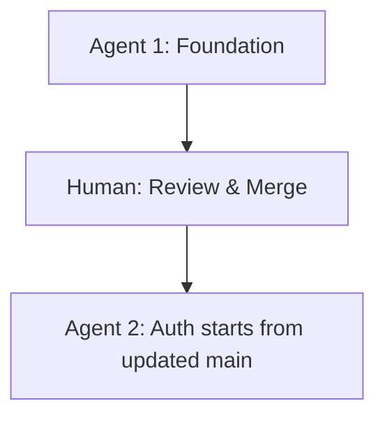
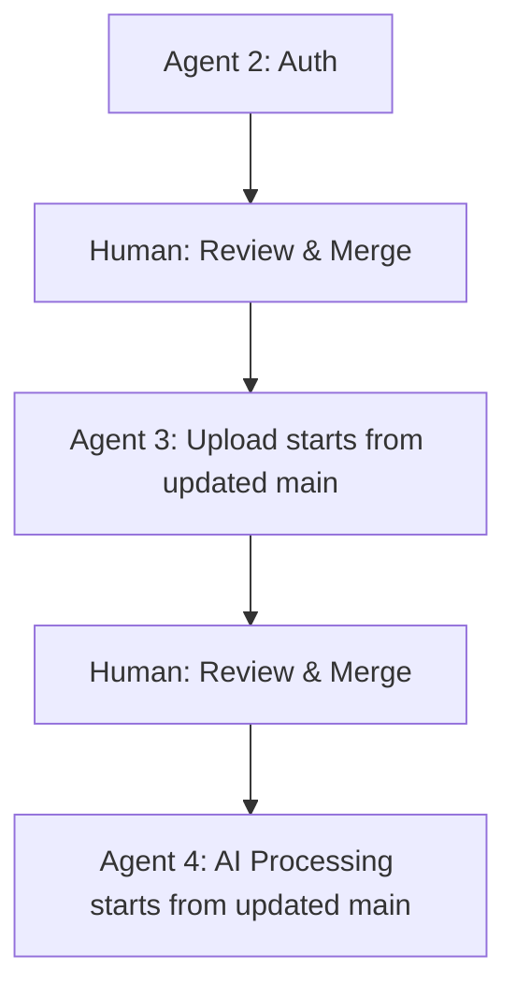
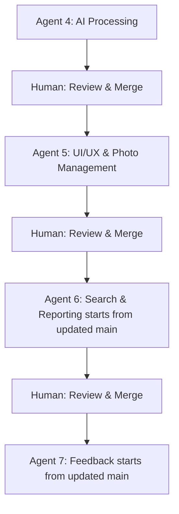
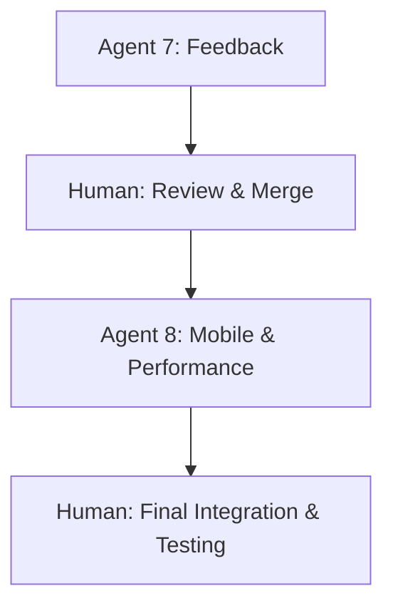

# Multi-Agent Development Strategy
## Machine Safety Photo Organizer MVP

**Document Version:** 1.0  
**Date:** June 30, 2025  
**Development Timeline:** 12 weeks  
**Target Agents:** 8 specialized Claude Code agents

---

## 1. Overview & Strategy

### Development Approach
This document outlines a parallel development strategy using **Git worktrees** and **Claude Code agents** to accelerate MVP delivery. Each agent works on isolated features in separate worktrees, allowing simultaneous development while maintaining code quality and integration safety.

### Key Principles
- **Parallel Development**: Multiple agents work simultaneously on different features
- **Clean Integration**: Git worktrees prevent merge conflicts and enable safe feature integration
- **Clear Dependencies**: Agents understand what they need from previous work
- **Quality Focus**: Each agent includes comprehensive testing and documentation
- **Human Oversight**: Critical decisions and integrations managed by human developer

---

## 2. Git Worktree Architecture

### Repository Structure
```bash
photo-organizer/                    # Main repository
├── main/                          # Main branch worktree (integration)
├── foundation/                    # Agent 1: Foundation & Infrastructure
├── auth/                         # Agent 2: Authentication & User Management
├── upload/                       # Agent 3: Photo Upload & Storage
├── ai-processing/                # Agent 4: AI Processing & Tagging
├── search/                       # Agent 5: Search & Discovery
├── organization/                 # Agent 6: Organization & Export
├── feedback/                     # Agent 7: Feedback & Analytics
└── mobile-perf/                  # Agent 8: Mobile & Performance
```

### Initial Setup Commands
```bash
# 1. Create main repository and initial structure
git clone https://github.com/your-org/photo-organizer.git
cd photo-organizer

# 2. Create worktrees for each agent
git worktree add foundation -b feature/foundation
git worktree add auth -b feature/auth
git worktree add upload -b feature/upload
git worktree add ai-processing -b feature/ai-processing
git worktree add search -b feature/search
git worktree add organization -b feature/organization
git worktree add feedback -b feature/feedback
git worktree add mobile-perf -b feature/mobile-perf

# 3. Verify worktree setup
git worktree list
```

### Worktree Management
```bash
# Switch between worktrees
cd foundation/    # Work on foundation features
cd ../auth/       # Switch to auth features

# Keep worktrees updated
git worktree foreach git pull origin main

# Remove completed worktrees
git worktree remove foundation
git branch -d feature/foundation  # Clean up branch
```

---

## 3. Agent Development Sequence & Dependencies

### Phase 1: Foundation (Weeks 1-2)


**Agent 1 → Human Review → Agent 2**

### Phase 2: Core Infrastructure (Weeks 3-4)


**Agent 2 → Human Review → Agent 3 → Human Review → Agent 4**

### Phase 3: Feature Development (Weeks 5-8)


**Agent 4 → Human Review → Agent 5 → Human Review → Agent 6 → Human Review → Agent 7**
*Note: Agents 5 and 6 were initially planned to run in parallel but were executed sequentially for better integration.*

### Phase 4: Optimization (Weeks 9-12)


**Agent 7 → Human Review → Agent 8 → Human Final Integration**

---

## 4. Merge Strategy & Integration

### Sequential Merge Protocol

#### Pre-Merge Checklist
```bash
# Before merging any agent's work:
cd main/
git pull origin main                    # Ensure main is current
git merge feature/[agent-name]         # Merge agent branch
npm run build                          # Verify build works
npm run test                           # Run all tests
npm run lint                           # Check code quality
```

#### Integration Testing Steps
1. **Functional Testing**: Test the specific feature works as expected
2. **Integration Testing**: Ensure new feature works with existing features
3. **Performance Testing**: Check no performance regressions
4. **Mobile Testing**: Verify responsive design still works
5. **Database Testing**: Confirm migrations and schema changes work

#### Merge Timing
- **Agent 1**: Immediate merge after completion (foundation needed by all)
- **Agent 2**: Merge before Agent 3 starts (auth needed for uploads)
- **Agent 3**: Merge before Agent 4 starts (uploads needed for AI processing)
- **Agent 4**: Merge before Agents 5&6 start (tags needed for search/organization)
- **Agents 5&6**: Can develop in parallel, merge both before Agent 7
- **Agent 7**: Merge before Agent 8 (feedback system needed for performance testing)
- **Agent 8**: Final integration and optimization

### Conflict Resolution Strategy

#### Prevention
```bash
# Each agent starts from latest main
cd [agent-worktree]/
git pull origin main
git rebase main  # Ensure clean history
```

#### Resolution Process
1. **Identify Conflicts**: Use `git status` and review conflict markers
2. **Understand Changes**: Review both versions and understand intent
3. **Resolve Intelligently**: Combine changes or choose appropriate version
4. **Test Resolution**: Ensure resolution doesn't break functionality
5. **Document Decision**: Add commit message explaining resolution

---

## 5. Agent Brief Templates & Communication

### Standard Agent Brief Structure
```markdown
# Agent [N]: [Feature Name]

## Context
- Previous agent deliverables you can use
- Current state of the application
- Your role in the overall system

## Primary Goal
- Single, clear objective for this agent

## Technical Requirements
- Specific technologies to use
- Code patterns to follow
- Performance requirements

## Deliverables
- [ ] Feature 1 with acceptance criteria
- [ ] Feature 2 with acceptance criteria
- [ ] Tests covering your features
- [ ] Documentation for next agent

## Integration Points
- APIs or components other agents will use
- Data structures other agents expect
- Interfaces you need from previous agents

## Definition of Done
- All features working as specified
- Tests passing (unit and integration)
- Code follows project standards
- Documentation updated
- No breaking changes to existing features
```

### Shared Context Document
Create a shared document that all agents reference:

```markdown
# Shared Development Context

## Project Standards
- TypeScript strict mode enabled
- ESLint + Prettier configuration
- Component naming: PascalCase
- File naming: kebab-case
- CSS: Tailwind utility classes only
- Components: shadcn/ui when possible

## Tech Stack Decisions
- Next.js 14 App Router
- Supabase (PostgreSQL + Auth + Storage + Edge Functions)
- shadcn/ui + Tailwind CSS
- TanStack Query + Zustand
- TypeScript throughout

## Database Schema
[Include current schema with relationships]

## API Contracts
[Define expected interfaces between components]

## Design System
- Color palette: [define colors]
- Typography scale: [define scales]  
- Spacing system: Tailwind defaults
- Component patterns: [link to examples]
```

---

## 6. Human Responsibilities & Tasks

### Pre-Development Setup (Week 0)

#### Account Creation & Configuration
- [ ] **GitHub Repository**
  - Create private repository: `photo-organizer`
  - Set up branch protection rules for main
  - Configure issue and PR templates
  - Add team members and collaborators

- [ ] **Supabase Project Setup**
  - Create new Supabase project: "Photo Organizer MVP"
  - Note project URL and anon key
  - Configure database settings (connection pooling, extensions)
  - Set up staging and production projects

- [ ] **Vercel Account & Deployment**
  - Connect GitHub repository to Vercel
  - Configure environment variables for staging/production
  - Set up custom domain (if needed)
  - Configure build settings for Next.js

- [ ] **AI Services Configuration**
  - Create Google Cloud account and project
  - Enable Gemini Vision API
  - Generate API keys and set billing limits
  - Configure usage monitoring and alerts

- [ ] **Development Environment**
  - Set up local development environment
  - Install required tools (Node.js, Git, VS Code extensions)
  - Configure environment variables for local development
  - Test all service connections locally

#### Project Initialization
- [ ] **Repository Structure**
  - Create initial README.md with setup instructions
  - Add .gitignore for Next.js + Node.js
  - Set up basic folder structure
  - Create initial package.json with dependencies

- [ ] **Development Standards**
  - Configure ESLint and Prettier
  - Set up Git hooks with Husky
  - Create code review checklist
  - Document coding standards and conventions

- [ ] **CI/CD Pipeline**
  - Configure GitHub Actions for automated testing
  - Set up deployment workflows for staging/production
  - Configure environment-specific builds
  - Set up automated dependency updates

### During Development (Weeks 1-12)

#### Daily Tasks
- [ ] **Agent Coordination**
  - Review agent progress and blockers
  - Provide clarifications on requirements
  - Resolve technical questions and decisions
  - Update shared context document as needed

- [ ] **Code Review & Integration**
  - Review completed agent work for quality and requirements
  - Test functionality before merging
  - Resolve merge conflicts when they occur
  - Maintain code quality standards

- [ ] **Project Management**
  - Track progress against timeline
  - Identify and resolve blockers
  - Communicate status to stakeholders
  - Adjust priorities as needed

#### Weekly Tasks
- [ ] **Integration Testing**
  - Test complete user workflows end-to-end
  - Verify cross-browser compatibility
  - Test mobile responsiveness
  - Validate performance benchmarks

- [ ] **Stakeholder Communication**
  - Provide progress updates to team
  - Demo completed features
  - Collect feedback and requirements clarifications
  - Plan upcoming week priorities

- [ ] **Technical Maintenance**
  - Update dependencies and security patches
  - Monitor service usage and costs
  - Review and optimize database performance
  - Backup and disaster recovery testing

### Phase Completion Tasks

#### After Each Agent Completion
- [ ] **Feature Validation**
  - Test all acceptance criteria met
  - Verify no regressions in existing features
  - Check performance impact
  - Validate security and data privacy

- [ ] **Documentation Updates**
  - Update technical documentation
  - Create/update user guides if needed
  - Document any architectural decisions
  - Update API documentation

- [ ] **Deployment & Monitoring**
  - Deploy to staging environment
  - Run automated and manual tests
  - Monitor for errors and performance issues
  - Update production environment when stable

#### Final Integration (Week 12)
- [ ] **Complete System Testing**
  - Full user workflow testing with real data
  - Performance testing with 400+ photos
  - Cross-device and browser compatibility
  - Security and accessibility audits

- [ ] **Production Deployment**
  - Final staging environment validation
  - Production deployment with monitoring
  - User training and onboarding materials
  - Launch communication and support setup

- [ ] **Success Metrics Setup**
  - Configure analytics and monitoring
  - Set up user feedback collection
  - Establish performance baselines
  - Create success measurement dashboard

---

## 7. Quality Assurance & Testing Strategy

### Agent Testing Responsibilities

#### Unit Testing (Each Agent)
```javascript
// Required test coverage for each agent
- Component rendering tests
- Function logic tests  
- Error handling tests
- Edge case validation
- Minimum 80% code coverage
```

#### Integration Testing (Human Oversight)
```javascript
// After each agent merge
- Feature interaction tests
- API integration tests
- Database operation tests
- Real user workflow tests
- Performance regression tests
```

### Testing Tools & Framework
```bash
# Testing stack for all agents
- Jest: Unit testing framework
- Testing Library: React component testing
- Playwright: E2E testing
- MSW: API mocking for tests
- Supabase Test Runner: Database testing
```

### Performance Testing Benchmarks
- **Upload**: 20 photos in < 2 minutes
- **Search**: Results in < 1 second
- **AI Processing**: Tags in < 30 seconds
- **Mobile Load**: Gallery in < 3 seconds
- **Database**: Queries in < 500ms

---

## 8. Communication Protocols

### Agent-to-Human Communication

#### Daily Check-ins
**When**: End of each development session  
**Format**: Brief status update including:
- Features completed
- Current blockers or questions
- Estimated completion time
- Next session priorities

#### Blocker Resolution
**When**: Immediately when encountered  
**Process**:
1. Agent documents blocker clearly
2. Human reviews within 4 hours
3. Provide guidance or requirements clarification
4. Agent continues with updated direction

#### Handoff Protocols
**When**: Agent completes their work  
**Requirements**:
- All acceptance criteria met
- Tests passing
- Documentation updated
- Clean, commented code
- Integration points clearly documented

### Human-to-Agent Communication

#### Requirements Clarification
```markdown
# Template for requirement updates
## Context
[Explain the business need or user feedback]

## Specific Change
[Exact requirement change or addition]

## Impact Assessment
[How this affects other features or agents]

## Priority
[High/Medium/Low with justification]
```

#### Technical Guidance
```markdown
# Template for technical decisions
## Decision Needed
[Specific technical choice required]

## Options Considered
[List alternatives with pros/cons]

## Recommendation
[Preferred approach with reasoning]

## Implementation Notes
[Specific implementation guidance]
```

---

## 9. Risk Management & Contingency Plans

### Development Risks

#### Agent Delays or Blockers
**Risk**: Agent unable to complete work on schedule  
**Mitigation**: 
- Build 20% buffer into timeline
- Have clear handoff documentation
- Prepare simplified fallback implementations
- Cross-train human on critical components

#### Integration Failures
**Risk**: Agent work doesn't integrate cleanly  
**Mitigation**:
- Frequent integration testing
- Clear API contracts between agents
- Rollback procedures for problematic merges
- Simplified integration paths for complex features

#### Technical Debt Accumulation
**Risk**: Fast development creates maintenance burden  
**Mitigation**:
- Code review standards for each agent
- Refactoring time built into schedule
- Technical debt tracking and prioritization
- Documentation requirements for all agents

### Business Risks

#### Scope Creep
**Risk**: Requirements expanding beyond MVP  
**Mitigation**:
- Clear MVP boundaries in PRD
- Change control process for new requirements
- Regular stakeholder communication about scope
- Post-MVP roadmap for additional features

#### User Adoption Issues
**Risk**: MVP doesn't meet user needs  
**Mitigation**:
- Early user testing (Week 6)
- Feedback collection system in MVP
- Iterative improvement process
- Clear user onboarding and training

---

## 10. Success Metrics & Monitoring

### Development Velocity Metrics
- **Agent Completion Rate**: On-time delivery percentage
- **Integration Success**: Clean merges without major rework
- **Bug Discovery Rate**: Issues found before vs after merge
- **Code Quality**: Test coverage and lint compliance

### Product Quality Metrics
- **Feature Completeness**: All acceptance criteria met
- **Performance Benchmarks**: Meeting specified targets
- **User Experience**: Smooth workflows without blockers
- **Technical Debt**: Maintainable, documented code

### Timeline Tracking
```markdown
# Weekly progress tracking
Week 1: Foundation setup and basic structure
Week 2: Authentication and user management
Week 3: Photo upload and storage
Week 4: AI processing and tagging
Week 5-6: Search and discovery features
Week 7-8: Organization and export features
Week 9-10: Feedback and analytics
Week 11-12: Mobile optimization and final polish
```

---

## 11. Post-MVP Considerations

### Technical Debt Management
- Schedule regular refactoring sessions
- Document architectural decisions for future reference
- Plan performance optimization sprints
- Maintain comprehensive test coverage

### Scaling Preparation
- Database optimization for larger datasets
- Multi-tenant architecture preparation
- API rate limiting and cost management
- Infrastructure scaling planning

### Continuous Improvement
- User feedback integration process
- AI model improvement pipeline
- Feature prioritization framework
- Regular security and dependency updates

---

## Appendix A: Emergency Procedures

### Critical Blocker Resolution
1. **Identify Impact**: Determine if blocker affects other agents
2. **Escalation Path**: Human review within 2 hours for critical blockers
3. **Workaround Strategy**: Implement temporary solution to unblock dependent work
4. **Resolution Timeline**: Set clear expectations for permanent fix

### Rollback Procedures
```bash
# If integration causes major issues
git revert [merge-commit]          # Revert problematic merge
git push origin main               # Update main branch
# Notify all agents of rollback
# Work with agent to fix issues before re-merge
```

### Communication Escalation
- **Minor Issues**: Document in daily check-in
- **Moderate Issues**: Immediate notification with 4-hour response SLA
- **Critical Issues**: Immediate resolution with all development paused if needed

This strategy ensures efficient parallel development while maintaining quality and integration safety throughout the MVP development process.