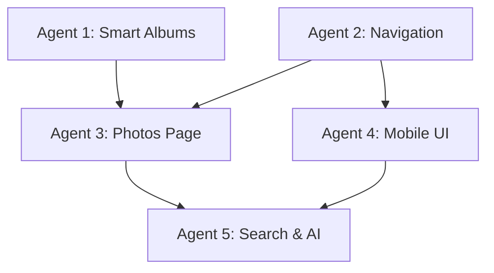

# UX Simplification Project Overview

**Project Goal:** Transform Minerva from a complex 9-section navigation to a streamlined 5-section Google Photos-inspired interface while maintaining essential organizational features.

## Project Structure

This folder contains the complete planning documentation for the UX simplification project, divided into manageable agent assignments.

### 📋 Master Document
- `google-photos-like-ux-simplification.md` - Complete strategy and requirements

### 🤖 Agent Briefs
- `agent-1-smart-albums-brief.md` - Smart Albums Infrastructure (1 week)
- `agent-2-navigation-restructure-brief.md` - Navigation Restructure (3-4 days)
- `agent-3-photos-simplification-brief.md` - Photos Page Simplification (1 week)
- `agent-4-mobile-ui-enhancements-brief.md` - Mobile & UI Enhancements (1 week)
- `agent-5-search-ai-features-brief.md` - Search & AI Features (1 week)

## Git Worktree Implementation Strategy

**This project uses git worktrees for parallel development by multiple Claude Code agents.**

### Worktree Structure
```
minerva/
├── (main repository)
└── worktrees/
    ├── agent-1-smart-albums/     # Branch: ux/smart-albums
    ├── agent-2-navigation/       # Branch: ux/navigation
    ├── agent-3-photos/           # Branch: ux/photos-simplification
    ├── agent-4-mobile/           # Branch: ux/mobile-ui
    ├── agent-5-search/           # Branch: ux/search-ai
    ├── integration/              # Branch: ux/integration
    └── testing/                  # Branch: main (clean testing)
```

### Development Workflow
1. **Setup Phase**: Create all worktrees and VS Code workspace
2. **Parallel Development**: Agents work in isolated worktrees
3. **Integration**: Merge successful features to integration branch
4. **Testing**: Final testing in clean environment
5. **Deployment**: Merge to main when ready

## Project Timeline

### Week 1: Foundation (Parallel)
- **Agent 1**: Smart Albums Infrastructure (worktrees/agent-1-smart-albums)
- **Agent 2**: Navigation Restructure (worktrees/agent-2-navigation)
- Both agents can work simultaneously without conflicts

### Week 2: Core Features
- **Agent 3**: Photos Page Simplification (worktrees/agent-3-photos)
  - Can merge from Agent 1 & 2 branches as needed
- **Agent 4**: Mobile & UI Enhancements (worktrees/agent-4-mobile)
  - Starts building on Agent 2's navigation changes

### Week 3: Advanced Features
- **Agent 5**: Search & AI Features (worktrees/agent-5-search)
  - Integrates with all previous agent work
- Integration testing in dedicated worktree

### Week 4: Integration & Polish
- Merge successful features to integration branch
- Performance optimization and testing
- Final integration to main branch
- User testing and documentation

## Navigation Transformation

### Before (9 sections)
1. Dashboard
2. Photos
3. Upload
4. Projects
5. Search
6. Analytics
7. Sites
8. AI Management
9. Settings

### After (5 sections)
1. **Photos** (landing page with integrated upload)
2. **Projects** (manual organization)
3. **Sites** (location-based organization)
4. **Search** (AI-powered with smart suggestions)
5. **Smart Albums** (auto-generated AI collections)

**Avatar Menu:** Profile, Settings, Organization, Help, Admin Access

## Key Features Being Added

### 🤖 Smart Albums (Agent 1)
- Auto-generated based on AI tags
- Equipment types (Conveyor Belts, Presses)
- Hazard types (Pinch Points, Sharp Edges)
- Time periods (This Week, Last Month)
- Site activity (Recent per location)
- Custom user-defined albums

### 📱 Mobile-First Design (Agent 4)
- Responsive breakpoints
- Touch-optimized interactions (44px+ targets)
- Gesture support (swipe, pinch, pull-to-refresh)
- Floating Action Button (FAB)
- Progressive loading
- Offline capabilities

### 🔍 Intelligent Search (Agent 5)
- Natural language queries
- Visual search with image upload
- AI-powered suggestions
- Smart album recommendations
- "More like this" functionality

### 🎯 Simplified Photos Page (Agent 3)
- Single grid view (remove list/masonry)
- Integrated drag-and-drop upload
- Simplified bulk operations
- Smart album quick filters
- Performance optimization

## Success Metrics

### User Experience
- Navigation depth: < 3 clicks to key features
- Time to first upload: < 60 seconds
- Mobile usability score: > 90/100
- New user completion: > 80%

### Technical Performance
- Page load time: < 2 seconds
- Component size reduction: 50%
- Mobile Lighthouse score: > 90
- Smart album queries: < 200ms

### Business Impact
- Increased photo upload frequency: +20%
- Improved user retention
- Reduced support tickets
- Enhanced mobile adoption

## Implementation Dependencies



### Critical Path
1. Agent 2 (Navigation) must complete before others start UI work
2. Agent 1 (Smart Albums) API needed for Agent 3 integration
3. Agent 3 (Photos) simplification enables Agent 4 mobile work
4. Agent 5 (Search) builds on all previous work

## Documentation Requirements

Each agent must provide:

### 📝 Progress Documentation
- Update documentation as work progresses
- Document design decisions and trade-offs
- Note any deviations from the brief

### 📋 Handover Document
Create `HANDOVER-AGENT-X.md` with:
- What was implemented
- Architecture decisions
- Performance benchmarks
- Testing results
- Known limitations
- Future enhancement suggestions
- Dependencies for other agents

### 🧪 Testing Results
- Unit test coverage
- Integration test results
- Performance benchmarks
- Cross-browser compatibility
- Mobile device testing

## Quality Standards

### Code Quality
- TypeScript strict mode
- 90%+ test coverage
- ESLint/Prettier compliance
- Component documentation

### Performance
- Core Web Vitals compliance
- Mobile-first optimization
- Efficient caching strategies
- Bundle size optimization

### Accessibility
- WCAG 2.1 AA compliance
- Keyboard navigation
- Screen reader support
- Touch accessibility

## Risk Mitigation

### Technical Risks
- Feature flags for gradual rollout
- Rollback plan for each change
- Comprehensive testing before deployment
- Performance monitoring

### User Experience Risks
- User migration guides
- Training materials
- Support team preparation
- Feedback collection system

## Git Worktree Workflow

### Development Process
1. **Work in Your Worktree**: Each agent develops in their dedicated worktree
2. **Regular Commits**: Commit progress to your branch regularly
3. **Share Dependencies**: Push branches so other agents can access your work
4. **Merge When Needed**: Other agents can merge your branch into theirs
5. **Integration Testing**: Test combinations in the integration worktree

### Branch Management
```bash
# Agent workflow example
cd worktrees/agent-1-smart-albums
# Work on features
git add .
git commit -m "Implement smart albums API"
git push origin ux/smart-albums

# Other agents can now access this work
cd worktrees/agent-3-photos
git merge ux/smart-albums  # Get Agent 1's smart albums API
```

### Port Management
Each worktree can run on different ports:
```bash
# Agent 1
cd worktrees/agent-1-smart-albums && npm run dev -- --port 3001

# Agent 2  
cd worktrees/agent-2-navigation && npm run dev -- --port 3002

# Agent 3
cd worktrees/agent-3-photos && npm run dev -- --port 3003
```

## Communication Protocol

### Daily Updates
- Progress against brief objectives
- Git branch status and shared dependencies
- Any blocking issues or dependencies
- Design decisions requiring input
- Performance or technical concerns

### Dependency Coordination
- **Agent 3** depends on Agent 1 (smart albums API) and Agent 2 (navigation)
- **Agent 4** depends on Agent 2 (navigation) and Agent 3 (simplified photos)
- **Agent 5** depends on Agent 1 (smart albums) and Agent 3 (photos integration)

### Weekly Milestones
- Branch merge status and integration progress
- Completed features demo (which worktree/port)
- Cross-agent integration testing results
- Handover document progress
- Next week planning and branch coordination

## Worktree Setup

### Prerequisites
- Main Minerva repository at `C:\Users\Tom\dev\minerva`
- VS Code installed
- Claude Code CLI available

### Initial Setup Commands
```bash
# Create all agent worktrees
git worktree add worktrees/agent-1-smart-albums -b ux/smart-albums
git worktree add worktrees/agent-2-navigation -b ux/navigation
git worktree add worktrees/agent-3-photos -b ux/photos-simplification
git worktree add worktrees/agent-4-mobile -b ux/mobile-ui
git worktree add worktrees/agent-5-search -b ux/search-ai

# Integration and testing worktrees
git worktree add worktrees/integration -b ux/integration
git worktree add worktrees/testing main

# Verify setup
git worktree list
```

### VS Code Workspace
Open the project workspace file:
```bash
code ux-simplification.code-workspace
```

### Environment Setup
Copy environment files to each worktree:
```bash
cp .env.local worktrees/agent-1-smart-albums/
cp .env.local worktrees/agent-2-navigation/
cp .env.local worktrees/agent-3-photos/
cp .env.local worktrees/agent-4-mobile/
cp .env.local worktrees/agent-5-search/
cp .env.local worktrees/integration/
```

## Getting Started (For Agents)

1. **Read the Master Document**: Start with `google-photos-like-ux-simplification.md`
2. **Review Your Brief**: Read your specific agent brief thoroughly
3. **Switch to Your Worktree**: `cd worktrees/agent-X-name/`
4. **Start Claude Code**: `claude-code` from your worktree directory
5. **Check Dependencies**: Review what other agents have completed
6. **Begin Implementation**: Start with Day 1 tasks in your brief
7. **Document Progress**: Update docs as you work
8. **Coordinate**: Use git branches to share progress with other agents

## Questions & Support

- **Technical Questions**: Review existing codebase and documentation
- **Design Questions**: Refer to master document and UI/UX guidelines
- **Dependencies**: Coordinate directly with other agents
- **Blockers**: Escalate immediately to project coordination

---

****Remember**: 
- Work in your dedicated worktree
- Push branches regularly for other agents
- Test in the integration worktree before final merge
- Use different ports for development servers
- Coordinate database changes across all agents
- Focus on user experience and maintain quality standards
- Document everything for smooth handovers!