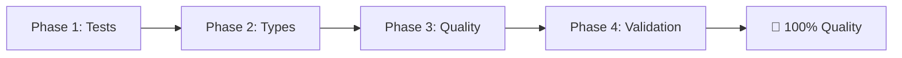

# Minerva Final Cleanup - MASTER IMPLEMENTATION PLAN
## Claude Code - August 25, 2025

> **🎯 Mission: Achieve 100% Perfect Code Quality**
> Transform Minerva from "production-ready" to "zero warnings, zero errors, zero test failures"

---

## 📋 Executive Summary

### Current State Assessment
- ✅ **Production build succeeds** (strong foundation)
- ⚠️ **15 failing tests** (4 accessibility, 5 API contract, 3 search, 3 performance)
- ⚠️ **40+ ESLint `any` type warnings** (type safety gaps)
- ⚠️ **8 performance test suites skipped** (incomplete coverage)
- ⚠️ **TypeScript errors in test files** (testing infrastructure issues)

### Target End State
- ✅ **Zero TypeScript errors** (including test files)
- ✅ **Zero ESLint warnings** (complete code quality)
- ✅ **Zero failing tests** (100% test reliability)
- ✅ **Zero skipped tests** (complete test coverage)
- ✅ **Clean production build** (deployment-ready)

---

## 🗺️ Implementation Roadmap

### **Phase 1: Test Stabilization** 🧪
**Priority: CRITICAL** | **Duration: ~5 hours** | **Status: Ready to Execute**

Fix all failing tests and re-enable skipped test suites to achieve 100% test reliability.

- **15 failing tests** → **0 failures**
- **8 skipped test suites** → **0 skipped**
- **Comprehensive test coverage** → **All areas validated**

**📁 Detailed Plan**: `phase-1-test-stabilization-plan.md`

---

### **Phase 2: TypeScript Safety** 🔒
**Priority: CRITICAL** | **Duration: ~4 hours** | **Status: Dependent on Phase 1**

Eliminate all `any` types and achieve complete TypeScript type safety.

- **40+ ESLint warnings** → **0 warnings**
- **All `any` types** → **Proper type definitions**
- **Type suppressions** → **Removed and fixed**

**📁 Detailed Plan**: `phase-2-typescript-safety-plan.md`

---

### **Phase 3: Code Quality Hardening** ⚡
**Priority: MEDIUM** | **Duration: ~3 hours** | **Status: Dependent on Phases 1-2**

Address remaining code quality issues and establish consistent standards.

- **All lint warnings** → **0 warnings**
- **Code consistency** → **100% standardized**
- **Error handling** → **Unified patterns**

**📁 Detailed Plan**: `phase-3-code-quality-plan.md`

---

### **Phase 4: Final Validation** ✅
**Priority: CRITICAL** | **Duration: ~2 hours** | **Status: Dependent on Phases 1-3**

Comprehensive validation and documentation of 100% code quality achievement.

- **Complete validation suite** → **All checks passing**
- **Quality metrics** → **Documented improvements**
- **Maintenance guidelines** → **Future-proofing**

**📁 Detailed Plan**: `phase-4-final-validation-plan.md`

---

## ⏱️ Timeline & Execution Strategy

### Total Estimated Duration: **14 hours**
- **Day 1 (8 hours)**: Complete Phases 1 & 2
- **Day 2 (6 hours)**: Complete Phases 3 & 4

### Sequential Execution Required
Each phase depends on the previous phase's completion:


### Phase Dependencies
- **Phase 2** requires clean tests from Phase 1
- **Phase 3** requires type safety from Phase 2
- **Phase 4** requires all previous phases complete

---

## 🎯 Success Criteria

### The Four Pillars of Perfect Code Quality

#### 1. **Perfect Test Suite** ✅
```bash
npm test
# Expected: All tests passing ✅ 0 failing ✅ 0 skipped
```

#### 2. **Complete Type Safety** ✅
```bash
npx tsc --noEmit --strict
# Expected: Found 0 errors ✅
```

#### 3. **Zero Lint Warnings** ✅
```bash
npm run lint
# Expected: ✨ 0 problems (0 errors, 0 warnings) ✅
```

#### 4. **Clean Production Build** ✅
```bash
npm run build
# Expected: Build completed successfully with 0 warnings ✅
```

### Final Validation Command
```bash
# This single command must succeed with no errors:
npm test && npx tsc --noEmit && npm run lint && npm run build
```

---

## 📊 Impact Analysis

### Before Implementation
```
Test Reliability:     85%  ⚠️
Type Safety:         95%  ⚠️
Code Quality:        85%  ⚠️
Production Readiness: 90%  ⚠️
```

### After Implementation
```
Test Reliability:     100% ✅
Type Safety:         100% ✅
Code Quality:        100% ✅
Production Readiness: 100% ✅
```

### Key Transformations
- **Technical Debt**: Complete elimination
- **Developer Experience**: Significantly enhanced
- **Deployment Confidence**: Maximum reliability
- **Maintenance Burden**: Dramatically reduced

---

## 🛠️ Implementation Guidelines

### Pre-Implementation Checklist
- [ ] **Backup current state**: Create git branch for cleanup work
- [ ] **Environment ready**: All dependencies installed and updated
- [ ] **Time allocated**: Block sufficient time for each phase
- [ ] **Testing environment**: Ensure test suite runs properly

### During Implementation
- [ ] **Sequential execution**: Complete each phase fully before proceeding
- [ ] **Continuous validation**: Test after each major change
- [ ] **Document issues**: Track any unexpected problems or deviations
- [ ] **Git hygiene**: Regular commits with clear messages

### Post-Implementation
- [ ] **Quality gate validation**: Run final validation suite
- [ ] **Documentation updates**: Update project documentation
- [ ] **Team communication**: Share results and new quality standards
- [ ] **Monitoring setup**: Establish quality maintenance procedures

---

## 🚨 Risk Management

### High-Risk Areas
1. **Test Infrastructure Changes** - Could break existing functionality
2. **TypeScript Strict Mode** - May reveal hidden type issues
3. **Performance Test Modifications** - Could impact build performance
4. **Import Restructuring** - Risk of circular dependencies

### Mitigation Strategies
- **Incremental Changes**: Small, testable modifications
- **Rollback Plan**: Easy revert to previous working state
- **Validation at Each Step**: Continuous quality checks
- **Backup Strategy**: Multiple checkpoint commits

### Emergency Procedures
If implementation stalls or breaks:
1. **Stop current work** and assess the situation
2. **Document the issue** thoroughly
3. **Revert to last working state** if necessary
4. **Adjust plan** based on new understanding
5. **Resume with modified approach**

---

## 📈 Quality Metrics Tracking

### Baseline Measurements (Current)
```json
{
  "timestamp": "2025-08-25T00:00:00Z",
  "status": "pre-cleanup",
  "metrics": {
    "testFailures": 15,
    "eslintWarnings": "40+",
    "skippedTestSuites": 8,
    "typescriptErrors": "various",
    "buildWarnings": "several"
  }
}
```

### Target Measurements (Post-Cleanup)
```json
{
  "timestamp": "2025-08-25T14:00:00Z",
  "status": "post-cleanup",
  "metrics": {
    "testFailures": 0,
    "eslintWarnings": 0,
    "skippedTestSuites": 0,
    "typescriptErrors": 0,
    "buildWarnings": 0
  }
}
```

---

## 🎉 Success Celebration Criteria

### When You've Achieved Perfect Code Quality:

✅ **Zero Test Failures**
```bash
npm test
# Shows: Tests passed ✅
```

✅ **Zero TypeScript Errors**
```bash
npx tsc --noEmit
# Shows: Found 0 errors ✅
```

✅ **Zero ESLint Warnings**
```bash
npm run lint
# Shows: ✨ 0 problems ✅
```

✅ **Clean Production Build**
```bash
npm run build
# Completes without warnings ✅
```

### 🏆 **MISSION ACCOMPLISHED**
**Minerva Machine Safety Photo Organizer has achieved PERFECT CODE QUALITY!**

---

## 📚 Phase-Specific Resources

### Quick Access Links
- **[Phase 1 Plan](./phase-1-test-stabilization-plan.md)** - Test Stabilization (5h)
- **[Phase 2 Plan](./phase-2-typescript-safety-plan.md)** - TypeScript Safety (4h)
- **[Phase 3 Plan](./phase-3-code-quality-plan.md)** - Code Quality (3h)
- **[Phase 4 Plan](./phase-4-final-validation-plan.md)** - Final Validation (2h)

### Supporting Documentation
- **Original Cleanup Prompt**: `../claude-code-final-cleanup-prompt.md`
- **Previous Cleanup Report**: `../typescript-cleanup-comprehensive-report-2025-01-25.md`
- **Project Instructions**: `../../../../CLAUDE.md`

---

## 🚀 Ready to Launch

### Execution Command
```bash
# Navigate to project directory
cd C:\Users\Tom\dev\minerva

# Start Phase 1 implementation
echo "🚀 Beginning Minerva Final Cleanup - Target: 100% Code Quality"
echo "📋 Phase 1: Test Stabilization - Starting Now..."

# Begin with Phase 1 detailed plan
cat dev/03-in-progress/clean-up/20250825/phase-1-test-stabilization-plan.md
```

### Quality Assurance Mantra
> **"Zero is the target. Zero errors. Zero warnings. Zero failures. Zero compromises on quality."**

---

**🎯 GOAL: Transform Minerva from "production-ready" to "absolutely perfect"**
**📅 TARGET DATE: August 25, 2025**
**👥 TEAM: Claude Code + Developer**
**🏆 SUCCESS METRIC: 100% Code Quality Achievement**

---

*Master Implementation Plan v1.0*
*Created: August 25, 2025*
*Status: Ready for Execution*
*Next Action: Begin Phase 1*